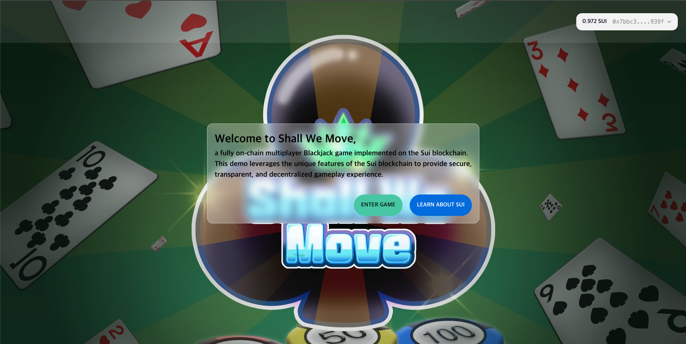
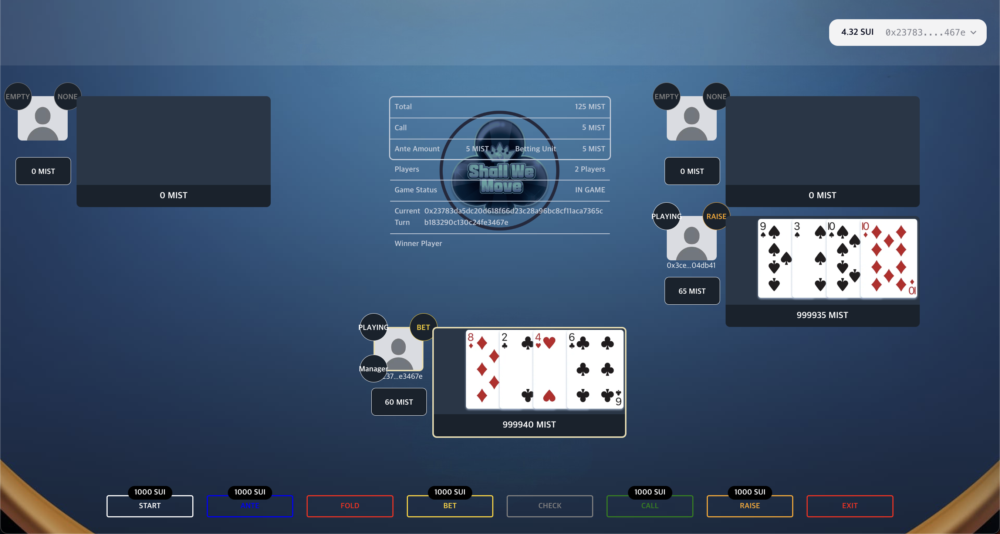

# Entirely Blockchain-Powered Multiplayer Card Game: _Play, Create, Share_

Welcome to **Shall We Move**, a fully on-chain multiplayer card game implemented on the Sui blockchain. This project leverages the unique features of the Sui blockchain to provide secure, transparent, and decentralized gameplay.

## Homepage


Immerse yourself in the game interface, crafted to provide a smooth and captivating card gaming experience with real-time multiplayer support.
<br><br>

## Game Interface


<br><br>

## Demo Video

[Watch this video on YouTube](https://youtube.com/playlist?list=PLsZNRVNR3wUxKXUe_5FjZcV0g90825sxl&si=o_1raNUMIIC5UCAd)
<br><br>

# Table of Contents

- [Overview](#overview)
- [Features](#features)
- [Tech Stack](#tech-stack)
- [Get Started](#get-started)
- [Game Rules](#game-rules)
  <br><br>

# Overview

**Shall We Move** is a decentralized application (dApp) that brings the classic 2-card poker game to the Sui blockchain. All game functionalities, including card dealing, shuffling, and hiding are executed on-chain using encryption and randomness to ensure fairness and transparency.
<br><br>

# Features

- **Multiplayer Support**: Play Blackjack with multiple players in real-time.
- **On-Chain Execution**: All game logic runs on the Sui blockchain, ensuring transparency and security.
- **Encryption**: Cards are encrypted to keep them hidden from other players.
- **Randomness**: Cards are distributed randomly to ensure fair play.
- **Next.js + Typescript Frontend**: A modern, responsive web interface for seamless gameplay.
  <br><br>

# Tech Stack

- **Frontend**: Next.js, Typescript
- **Blockchain**: Sui
- **Smart Contracts**: Move language
  <br><br>

# Get Started

To run the project locally, follow these steps:

## Prerequisites

- Node.js (v18.17.0 or later)
- pnpm
- Sui Blockchain node (or access to a Sui node)
  <br><br>

## Clone the Repository

```bash
git clone https://github.com/ShallWeMove/Overflow2024.git
```

<br>

## Smart Contracts

### Publish the Smart Contracts

you should see the package address in the output after running the command below.

```bash
cd shallwemove
sui client publish
```

after update shallwemove/Move.toml

```bash
cd ../poker_logic
sui client publish
```

### Create your Casino & Lounge on the Sui Blockchain

you should see the casino and lounge addresses in the output after running the command above. Use these addresses to create your casino and lounge on the Sui blockchain.

```bash
### create-casino
sui client call --package {package_address} --module cardgame --function create_casino --args {n_value_of_public_key} --gas-budget 1000000000
ex) sui client call --package 0xd10b25e4b34a013949d22666cf115cd01c2b0714585cd260122cb3e627893b63 --module cardgame --function create_casino --args 35263 --gas-budget 1000000000

### create lounge
sui client call --package {package_address} --module cardgame --function create_lounge --args {casino_id} {max_round} --gas-budget 1000000000
ex) sui client call --package 0xd10b25e4b34a013949d22666cf115cd01c2b0714585cd260122cb3e627893b63 --module cardgame --function create_lounge --args 0xd3b23a73870de6f5958e33fa18801757c826ee1dab6762bb412842fa9f8b233c 1 --gas-budget 1000000000

### add game table to lounge
sui client call --package {package_address} --module cardgame --function add_game_table --args {casino_id} {lounge_id} {ante_amount} {bet_unit} {game_seats} 0x0000000000000000000000000000000000000000000000000000000000000008 --gas-budget 1000000000
ex) sui client call --package 0xd10b25e4b34a013949d22666cf115cd01c2b0714585cd260122cb3e627893b63 --module cardgame --function add_game_table --args 0xd3b23a73870de6f5958e33fa18801757c826ee1dab6762bb412842fa9f8b233c 0x287ee1df5522907fe9aad6a47ff03dfa1b868cbb82c17118ea625140c63e7847 500 500 5 0x0000000000000000000000000000000000000000000000000000000000000008 --gas-budget 1000000000
```

<br>

## Frontend

### Set Environment Variables

- package address
- casino address
- lounge address

`cd frontend` and update the top line of `src/api/game.ts` file with the following content:

```
const ORIGINAL_CARDGAME_PACKAGE_ID =
	"0xd10b25e4b34a013949d22666cf115cd01c2b0714585cd260122cb3e627893b63";
const LATEST_CARDGAME_PACKAGE_ID =
	"{LATEST SHALLWEMOVE PACKAGE ID}";
const CASINO_ID = "{YOUR CASINO ID}";
const LOUNGE_ID = "{YOUR LOUNGE ID}";
const GAME_LOGIC_PACKAGE_ID = "{YOUR PACKAGE ID}";
```

### Install Dependencies

```bash
pnpm install
```

### Start the Development Server

```bash
pnpm dev
```

<br><br>

# Mini Poker: Instructions, Rules, and Hand Rankings

## Overview

In contrast to traditional poker, which utilizes 5 cards, Mini Poker is played with only 2 cards, forming combinations to create hands (poker hands). Following the 2-card rule, players are given one card each, engage in betting, then receive the second card and proceed with another round before revealing their hands to determine the winner. When the game ends, the draw rule is applied, ensuring that players' cards remain undisclosed throughout the game.
<br><br>

## Wallet Setup

- Connect your Sui wallet.
- In the wallet settings, set the Network to Testnet, as only Testnet is supported.
- If you don't have any Testnet Sui Tokens, click the "Request Testnet Sui Tokens" button.
  <br><br>

## Starting the Game

- To join the game, click the "Enter Game" button on the homepage.
- Press the "Ante" button to indicate your intention to participate.
- The game requires at least 2 players to start and can accommodate up to 5 players.
- Once 2 or more players have joined and pressed the "Ante" button, the Manager can click the "Start Game" button to begin.
  <br><br>

## Betting Rules

- **Ante**
  - The mandatory initial bet placed at the beginning of the game to ensure active participation and discourage excessive folding without betting.
  - It serves to encourage more proactive betting behavior.<br><br>
- **Check**
  - A privilege given to the player who either must bet the minimum amount or the first player to bet regardless of their hand.
  - It allows them to pass their turn without adding more money to the pot.<br><br>
- **Bet**
  - The act of placing the first bet after card exchange or additional distribution.
  - If no one bets, the round progresses with everyone checking, without further betting.<br><br>
- **Call**
  - Accepting the amount of money bet by the previous player.<br><br>
- **Raise**
  - Accepting the previous bet and adding more to it.<br><br>
- **Fold**
  - Giving up the hand, resulting in the loss of any money bet before folding.
  - Folding is used to minimize further losses when a player determines that their hand has little chance of winning.
    <br><br>

## Hand Rankings

### 1. Straight Flush Series

- **Royal Straight Flush**: A combination of A and K cards of the same suit. It is the strongest hand.
- **Back Straight Flush**: A combination of A and 2 cards of the same suit. Depending on the rules, it may be recognized as the second strongest hand.
- **Straight Flush**: A combination of two consecutive numbers of the same suit. It is the third strongest hand.

### 2. Pair

- A pair consists of two cards with the same number or the same letter, such as J, Q, K.

### 3. Straight Series

- **Royal Straight (Mountain)**: A combination of A and K cards with different suits. It is one of the strongest combinations among straight hands.
- **Back Straight**: It consists of A and 2 cards with different suits.
- **Straight**: A combination of two consecutive numbers with different suits. In mini poker, similar to three of a kind, this hand is considered higher than a flush.

### 4. Flush

- A flush consists of two cards of the same suit.

### 5. Top

- The highest single card in a hand, not forming any particular combination. It does not contribute to any specific hand rank. An Ace (A) is the highest top card, and a 4 is the lowest.
